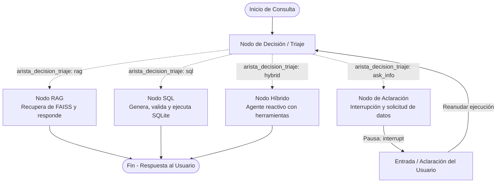

# 🎓 EduTech Academy AI Agent
### *Asistente Inteligente Conversacional Multicanal (LangGraph + RAG + Text-to-SQL)*

---

[-orange?style=for-the-badge&logo=oracle)](http://140.84.166.161/)
[](https://www.python.org/)
[](https://langchain-ai.github.io/langgraph/)
[](https://deepmind.google/technologies/gemini/)

Este repositorio contiene la implementación del **Agente Inteligente de EduTech Academy**, desarrollado para el **Challenge Alura Agente**. Es una solución robusta basada en inteligencia artificial capaz de resolver de forma interactiva consultas de alumnos sobre la academia. 

El agente utiliza un flujo conversacional inteligente que combina **Recuperación Generativa de Información (RAG)** a partir de documentos no estructurados con consultas estructuradas en tiempo real a una base de datos mediante **Text-to-SQL**, decidiendo de forma autónoma la mejor ruta para responder a cada consulta o solicitando aclaraciones adicionales cuando sea necesario.

---

## ☁️ Enlace de Prueba y Evidencia de Despliegue (OCI)

El agente ha sido desplegado exitosamente en la nube utilizando **Oracle Cloud Infrastructure (OCI)**. Está disponible de forma pública para pruebas en el siguiente enlace:

👉 **[http://140.84.166.161/](http://140.84.166.161/)**

### Detalles del Despliegue en OCI:
- **Infraestructura**: Instancia VM Compute de OCI (`VM.Standard.A1.Flex` u `Always Free`).
- **Sistema Operativo**: Oracle Linux.
---

## 📄 Descripción General del Proyecto

EduTech Academy maneja dos grandes dominios de información:
1. **Información No Estructurada (Políticas y Documentación)**: Manuales de uso, reglamento del estudiante, políticas de becas, términos de servicio y preguntas frecuentes (FAQ).
2. **Información Estructurada (Datos Académicos y Administrativos)**: Catálogo de cursos activos, precios, duraciones, profesores asignados, cupos disponibles en tiempo real, registro de estudiantes inscritos, su progreso académico e historial de certificados emitidos.

El **Agente Inteligente** funciona como un punto de acceso unificado que:
- **Clasifica** la intención de la pregunta del usuario.
- **Consulta de forma dinámica** la base documental indexada (vía FAISS y Gemini Embeddings) o la base de datos SQL (vía generación, validación y ejecución de consultas en SQLite).
- **Ejecuta tareas híbridas** mediante un agente React autónomo cuando la respuesta requiere consolidar ambas fuentes.
- **Mantiene memoria a corto plazo** por cada hilo de conversación (`thread_id`), permitiendo interacciones fluidas de seguimiento.
- **Pausa su ejecución (Interrupts)** cuando el usuario envía una pregunta incompleta, esperando que este complete la aclaración antes de continuar con la resolución lógica.

---

## 📐 Arquitectura de la Solución

La solución está construida sobre un **Grafo de Estados** implementado con **LangGraph**.Esto permite manejar ciclos lógicos y estados pausados por intervención del usuario (*Human-in-the-Loop*) de forma nativa.

### Diagrama del Flujo del Grafo



### Componentes de la Arquitectura

1. **Estado del Agente (`AgentState`)**: Estructura de datos (`TypedDict`) que fluye a través de los nodos del grafo. Almacena la consulta actual, las consultas modificadas por los reescritores de prompts, la ruta seleccionada, los documentos recuperados, los resultados de consultas SQL, el historial acumulado de la conversación y el canal final de salida.
2. **Nodo de Decisión (`decision_node`)**: Es el enrutador central. Utiliza `gemini-3.1-flash-lite` con salidas estructuradas (`with_structured_output` de Pydantic) para mapear de manera estricta la consulta a una de las siguientes rutas: `rag`, `sql`, `hybrid`, `ask_info` o `deny`.
3. **Nodo de RAG (`rag_node`)**: 
   - Aplica un **Query Rewriter** (`rag_rewriter_chain`) para formular una versión de la pregunta optimizada para búsqueda semántica. Utilizando el modelo `command-a-plus-05-2026`
   - Realiza una consulta paralela en la base vectorial con la pregunta original y la reescrita.
   - Pasa los fragmentos recuperados a un prompt especializado que sintetiza la respuesta final.
4. **Nodo de SQL (`sql_node`)**:
   - Reescribe la pregunta del usuario para eliminar ambigüedades.
   - Genera una sentencia SQL válida para SQLite (`sql_generator`). Convierte la consulta en lenguaje natural (Natural Language) a una sentencia SQL válida para SQLite (NL-to-SQL).
   - Valida la sintaxis del código SQL generado (`sql_validator`) para evitar inyecciones o errores de ejecución.
   - Ejecuta la consulta de forma segura contra la base de datos (`sql_executor`).
   - Genera una respuesta en lenguaje natural a partir de los datos tabulares devueltos (`sql_response_generator`).
5. **Nodo Híbrido (`hybrid_node`)**: Crea un agente reactivo dinámico que dispone de dos herramientas: `consultar_base_de_datos_tool` y `consultar_documentos`. El agente decide el orden de ejecución para responder a preguntas cruzadas.
6. **Nodo de Aclaración (`ask_info_node`)**: Diseñado para preguntas vagas del dominio. Utiliza el modelo `gemma-4-26b-a4b-it` para redactar una pregunta clara sobre el dato faltante y llama a `interrupt()` de LangGraph. Esto congela el estado de la máquina de estados. Al recibir la respuesta del usuario, el grafo se reanuda, concatenando la aclaración a la consulta original y reevaluando la decisión.
7. **Persistencia y Memoria (`MemorySaver`)**: Almacena en memoria ram el estado exacto de cada `thread_id` (hilo conversacional), lo que permite que Streamlit pueda redibujar la interfaz de usuario en cada interacción (*rerun*) sin perder la memoria de la conversación del estudiante ni los checkpoints del grafo.

---

## 🛠️ Tecnologías y Herramientas Utilizadas

| Componente / Tecnología | Biblioteca / Herramienta | Propósito / Rol en la Solución |
| :--- | :--- | :--- |
| **Lenguaje Core** | `Python 3.10+` | Lenguaje de desarrollo principal del agente. |
| **Orquestación** | `LangGraph` | Creación de la máquina de estados con ciclos, flujos condicionales y soporte nativo para interrupciones de usuario (`interrupt`). |
| **Framework LLM** | `LangChain / LangChain-Core` | Gestión de plantillas de prompts, chains estructurados y enlace con herramientas. |
| **Modelos de Lenguaje** | `Google Gemini 3.1 Flash Lite`<br>`Gemma 4 26B` <br> `Command A+ 05`| Modelos de IA utilizados para clasificación de intenciones, traducción Text-to-SQL, reformulación y síntesis de respuestas. |
| **Embeddings** | `gemini-embedding-001` | Generación de vectores de alta dimensionalidad para búsqueda semántica en la documentación. |
| **Base Vectorial** | `FAISS (CPU)` | Motor de indexación rápida local para almacenamiento y búsqueda similitud de documentos. |
| **Base de Datos Relacional**| `SQLite` / `SQLAlchemy` | Base de datos local para almacenamiento estructurado del ecosistema escolar y mapeo ORM. |
| **Interfaz Web** | `Streamlit` | Interfaz gráfica interactiva y responsiva con soporte para hilos conversacionales y visualización opcional de documentos de depuración. |
| **Procesamiento de Documentos** | `MarkdownTextSplitter` | Segmentador que respeta la estructura Markdown para dividir los archivos de soporte técnico en fragmentos homogéneos de 1000 caracteres con 100 de solapamiento. |

---

## 🚀 Instrucciones para Ejecutar el Proyecto Localmente

Sigue estos pasos para poner en marcha el proyecto en tu entorno local:

### 1. Requisitos Previos
- Tener instalado **Python 3.10** o superior.
- Obtener una **API Key de Google** para acceder a los modelos Gemini y Gemma (puedes solicitarla gratuitamente en Google AI Studio).
- Obtener una **API Key de Cohere** para acceder al modelo Command A+ 05 (se puede conseguir una desde su pagina web)


### 2. Clonación e Instalación
Clona el repositorio e ingresa al directorio del proyecto:
```bash
git clone https://github.com/SolidW05/EduTech_Academy
cd EduTech_Academy
```

Crea un entorno virtual y actívalo:
* **En Windows:**
  ```powershell
  python -m venv .venv
  .venv\Scripts\activate
  ```
* **En macOS/Linux:**
  ```bash
  python3 -m venv .venv
  source .venv/bin/activate
  ```

Instala todas las dependencias requeridas:
```bash
pip install -r requirements.txt
```

### 3. Configuración del Entorno
Crea un archivo llamado `.env` en la raíz del proyecto y define las siguientes variables:
```env
GOOGLE_API_KEY=tu_api_key_de_gemini_aqui
COHERE_API_KEY=tu_api_key_de_cohere_aqui
```

### 4. Inicializar la Base de Datos (Sembrado)
Ejecuta el script para construir la estructura de tablas e insertar todos los datos iniciales de prueba (cursos, alumnos inscritos, instructores y certificados), si es que no estan o el archivo  `database/educational.db` fue eliminado:
```bash
python -c "from database.seed import seed; seed()"
```
> [!NOTE]  
> Este script creará el archivo de base de datos relacional en `database/educational.db`.

### 5. Indexación RAG (Automática)
No es necesario ejecutar un proceso manual para indexar los documentos en la base vectorial, porque ya fueron indexados. Pero si no se encontraran, el sistema leerá los archivos Markdown ubicados en la carpeta `docs/`, generará los fragmentos correspondientes con `MarkdownTextSplitter`, calculará los embeddings y guardará localmente los archivos binarios de FAISS en la carpeta `rag/`, solamente siendo necesario hacerlo una vez.

### 6. Lanzar la Aplicación Streamlit
Inicia el servidor web local con la interfaz de usuario:
```bash
streamlit run app.py
```
Se abrirá automáticamente una pestaña en tu navegador web en la dirección local por defecto: `http://localhost:8501`.

---

## ❓ Ejemplos de Preguntas que el Agente puede Responder

El enrutador inteligente de EduTech Academy clasificará tu pregunta y la dirigirá al canal apropiado:

| Categoría de Pregunta | Ejemplo de Consulta | Canal Interno |
| :--- | :--- | :--- |
| **Políticas y Reglamento** | *¿Cuál es la política de reembolsos si no me gusta un curso?* | **RAG** (Consulta el documento `04_Politica_de_Reembolsos.md`) |
| **Requisitos Académicos** | *¿Cómo puedo postularme al programa de becas y qué documentos necesito?* | **RAG** (Consulta el documento `03_Politica_de_Becas.md`) |
| **Estadísticas de Cursos** | *¿Cuánto cuesta el curso de Python desde Cero y cuántos cupos quedan?* | **SQL** (Consulta las columnas `price` y `available_slots` de `courses`) |
| **Progreso de Alumnos** | *¿Cuál es el porcentaje de avance del estudiante Mateo Pérez?* | **SQL** (Realiza un JOIN entre `students` y `enrollments`) |
| **Consultas Híbridas** | *¿Quién imparte el curso de Machine Learning y cómo puedo solicitar un reembolso?* | **Hybrid** (Consulta base de datos de profesores y documentos de reembolsos) |
| **Preguntas Incompletas** | *¿Cuánto cuesta?* | **Ask Info** (Interrumpe el grafo y pregunta: *¿De qué curso deseas saber el precio?*) |
| **Fuera de Dominio** | *¿Quién ganó el mundial de fútbol de 2022?* | **Deny** (Rechazo de la peticion) |

---

## 💬 Ejemplos de Respuestas Generadas por el Agente

A continuación se muestran ejemplos reales del comportamiento interno y de la respuesta final del agente según el nodo activado:

### 📥 Ejemplo 1: Canal RAG (Consultas sobre Políticas de la Academia)
* **Pregunta**: *¿Puedo pedir reembolso de un curso si ya empecé a ver las clases?*
* **Ruta Activada**: `rag`
* **Fragmento de Contexto Recuperado (`04_Politica_de_Reembolsos.md`)**:
  > *"...El estudiante puede solicitar reembolso total o parcial por derecho de retracto dentro de los 7 días naturales posteriores a la fecha de compra, siempre que no haya consumido más del 20 % del contenido del curso..."*
* **Respuesta del Asistente**:
  > Sí, puedes solicitar un reembolso bajo la política de derecho de retracto, siempre y cuando realices la solicitud dentro de los **7 días naturales** posteriores a la compra y no hayas superado el **20 % de avance** del contenido total del curso.

---

### 🗄️ Ejemplo 2: Canal SQL (Consultas de Datos Estructurados)
* **Pregunta**: *¿Qué cursos tiene a su cargo el profesor Pedro Sánchez?*
* **Ruta Activada**: `sql`
* **Sentencia SQL Generada y Ejecutada**:
  ```sql
  SELECT c.name, c.level, c.price 
  FROM courses c
  JOIN course_instructors ci ON c.id = ci.course_id
  JOIN instructors i ON ci.instructor_id = i.id
  WHERE i.first_name = 'Pedro' AND i.last_name = 'Sánchez';
  ```
* **Resultado de la Base de Datos**:
  ```json
  [
    {"name": "Java desde Cero", "level": "Básico", "price": 64.99},
    {"name": "Java Enterprise con Spring Boot", "level": "Avanzado", "price": 179.99}
  ]
  ```
* **Respuesta del Asistente**:
  > El profesor Pedro Sánchez imparte actualmente los siguientes cursos:
  > 1. **Java desde Cero** (Nivel Básico) - Precio: $64.99 USD
  > 2. **Java Enterprise con Spring Boot** (Nivel Avanzado) - Precio: $179.99 USD

---

### 🔀 Ejemplo 3: Canal Híbrido (Combinación de Datos y Documentación)
* **Pregunta**: *¿Cuánto cuesta el curso de Machine Learning Aplicado y qué promedio necesito para renovar una beca en ese curso?*
* **Ruta Activada**: `hybrid`
* **Ejecución interna (ReAct Agent)**:
  1. Llama a la herramienta `consultar_base_de_datos` con la consulta del precio. Ejecuta:
     `SELECT price FROM courses WHERE name LIKE '%Machine Learning Aplicado%';` (Resultado: `$149.99`).
  2. Llama a la herramienta `consultar_documentos` para la política de becas. Extrae del manual de becas: *"...Haber mantenido un promedio final igual o superior a 80/100 en el curso..."*
* **Respuesta del Asistente**:
  > El curso **Machine Learning Aplicado** tiene un costo de **$149.99 USD**. Respecto a tu consulta sobre la beca, para poder renovar el beneficio en un curso subsecuente, la normativa académica de la plataforma requiere que mantengas un promedio final igual o superior a **80/100** y completes al menos el 90 % del contenido del curso becado.

---

### ⏸️ Ejemplo 4: Canal Ask Info (Aclaración de Información)
* **Pregunta**: *¿En qué fecha me inscribí?*
* **Ruta Activada**: `ask_info`
* **Comportamiento del Grafo**: La pregunta es de dominio (inscripción), pero no especifica el nombre del alumno. El nodo `ask_info_node` detiene el proceso lanzando una interrupción.
* **Respuesta del Asistente (Pregunta de aclaración)**:
  > ¿Podrías indicarme tu nombre completo o el correo electrónico con el que estás registrado para poder buscar tu historial de inscripciones?
* *(El usuario responde en el chat: "Mateo Pérez")*
* **Comportamiento del Grafo**: Se reanuda el flujo, combinando el contexto. La pregunta se reescribe como: *¿En qué fecha se inscribió Mateo Pérez?* El enrutador redirige a `sql`, ejecuta la consulta y devuelve:
  > Mateo Pérez se inscribió en el curso **Machine Learning Aplicado** el **10 de febrero de 2025** y en el curso **Python desde Cero** el **3 de mayo de 2025**.

---

### 🚫 Ejemplo 5: Canal Deny (Fuera de Ámbito)
* **Pregunta**: *Dame una receta para cocinar lasaña.*
* **Ruta Activada**: `deny` (redirección a `ask_info` que evalúa la exclusión)
* **Respuesta del Asistente**:
  > Lo siento, pero solo puedo ayudarte con temas relacionados al funcionamiento de EduTech Academy (cursos, inscripciones, instructores, becas, reglamentos y certificados). Si tienes alguna pregunta acerca de nuestra oferta educativa o las políticas del portal, estaré encantado de ayudarte.

---

## 📂 Estructura del Proyecto

```text
├── app.py                # Interfaz de usuario (Streamlit UI) y configuración de chats
├── requirements.txt      # Archivo de dependencias del sistema
├── .env                  # Variables de entorno (API Keys de Google Gemini/Gemma/Cohere)
├── docs/                 # Base documental oficial (Políticas y Reglamentos en Markdown)
├── database/             # Base de datos relacional y Scripts de persistencia
│   ├── educational.db    # Base de datos SQLite (Generada tras el seed)
│   ├── models.py         # Declaración del modelo ORM (SQLAlchemy)
│   ├── seed.py           # Inserción de datos iniciales del ecosistema académico
│   └── utils/
│       ├── sql_chain.py               # Pipeline de lenguaje natural a SQL
│       └── sql_executor.py            # Ejecutor de codigo SQL sobre la base de datos educational.db
│       └── sql_generator.py           # Cadena generadora de codigo sql
│       └── sql_response_generator.py  # Genera una respuesta en base a la consulta a la BDD
│       └── sql_rewriter_chain.py      # Cadena para reescribir la pregunta del usuario
│       └── sql_validator.py           # Funcion para validar que el codigo SQL generado solo permita SELECT
├── config/               # Clases de inicialización de configuración y base de datos
│   ├── database.py       # Configuración de conexión de SQLAlchemy
│   └── settings.py       # Carga de variables de entorno con dotenv
├── ai_models/            # Proveedor de inicialización de LLMs y Embeddings
│   ├── llm.py            # Factoría de inicialización de Gemini y Gemma
│   └── embeddings_models.py # Configuración de Google Generative AI Embeddings
├── prompts/              # Repositorio de prompts estructurados para el agente
│   └── prompts.py        # Prompts del Router, Reescritores, Aclaración y Denegación
├── rag/                  # Lógica del motor de Recuperación Generativa (RAG)
│   ├── loader.py         # Cargador de documentos Markdown de docs/
│   ├── spliter.py        # Divisor de documentos en fragmentos (MarkdownTextSplitter)
│   ├── vectorstore.py    # Generador/cargador del índice vectorial FAISS
│   ├── retriever.py      # Configuración del recuperador semántico (k=5)
│   └── utils/
│       ├── rag_chain.py  # Pipeline ejecutor del RAG
│       └── rag_rewriter_chain.py # Cadena para reescribir consultas de búsqueda
├── graph/                # Orquestador del Agente Conversacional (LangGraph)
│   ├── state.py          # Definición de la estructura de estado AgentState
│   ├── nodes.py          # Lógica ejecutable de los nodos (SQL, RAG, Hybrid, Ask Info, Deny)
│   ├── router.py         # Condicionales para derivar ejecuciones (arista_decision_triaje)
│   └── graph.py          # Compilación y ensamblado del flujo de LangGraph
└── tools/                # Herramientas del agente híbrido
    ├── rag_tool.py       # Envoltorio de la función RAG como herramienta LangChain
    └── sql_tool.py       # Envoltorio de la función SQL como herramienta LangChain
```
